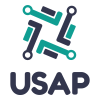

<div align = "center">



<h1>Team USAP</h1>


# Vaccination System Backend 🚀
    
Vaccination System Backend for solution of effective vaccination distribution.


## About  💫

The Aim of the project is to provide a backend for mobile application and make a sustainable backend for effective vaccination distribution between citizens and Vaccine Distribution Entities


### Some Salient Features of Project 🔭
    --  TBD --


## Getting Started ⚙️

These instructions will get you a copy of the project up and running on your local machine for development and testing purposes. 

We follow a systematic Git Workflow -
- Create a fork of this repo.
- Clone your fork of your repo on your pc.
- [Add Upstream to your clone](https://help.github.com/en/github/collaborating-with-issues-and-pull-requests/configuring-a-remote-for-a-fork)
- **Every change** that you do, it has to be on a branch. Commits on master would directly be closed.
- Make sure that before you create a new branch for new changes,[syncing with upstream](https://help.github.com/en/github/collaborating-with-issues-and-pull-requests/syncing-a-fork) is neccesary.


### Setup and running of project (Backend) 🧮
- Fork the repo and clone it.
- Go in the repo and setup virtual environment using <br>
```python -m virtualenv venv``` 
- Then activate the environment using <br>
    On Windows
```source venv/Scripts/activate```
    On MacOS/Linux
```source venv/bin/actiavte```
- Install requirements\
```pip install -r requirements.txt```

- Change into the `./vacc` directory.
   > All the following steps are to be executed in the vacc directory.

-- below two are optional steps --
- set secret key for your django project.
- You can use [https://djecrety.ir/] to generate your secret key


- After the above setup, run \
```python manage.py makemigrations```\
```python manage.py migrate```

- Start the backend server\
    ```python manage.py runserver```\
    Runs the backend server at default port ```8000```.\
    Open [http://localhost:8000](http://localhost:8000) to view it in the browser.

The page will reload if you make edits.<br />


#### Note
- If you are adding any new requirements for the project, make sure that you are adding it to ```requirements.txt```


## Built With ⚒
### Backend & Website 📡
* [Django 3.0](https://www.djangoproject.com) - The web framework used in the project.
* [Django Graphene ( Django Graphene )](https://docs.graphene-python.org/projects/django/en/latest/) - Used to generate GraphQL API
* [Django Rest Framework](https://www.django-rest-framework.org) - Does the magic of making REST API endpoints 
  

  
### Mobile Application( New Repo Soon ) 📲
* [React Native](https://reactnative.dev)- Better to write one codebase instead of two 😉

## Versioning 🗓

We use [SemVer](http://semver.org/) for versioning. 

## Authors ✍🏻

* **Shreshth Arora** - *Idea & Backend & Deployment* - [AroraShreshth](https://github.com/AroraShreshth)
* **Parth Shah** - *Backend Django and React Native* - [parthsujalshah](https://github.com/parthsujalshah)
* **Aakash Agarwal** - *React Native* - [Aakash310](https://github.com/Aakash310)
* **Uttaran Sarkar** - *Idea and React Native* - [uttaransarkar](https://github.com/uttaransarkar)

##Design

https://drive.google.com/file/d/16tAzU78Q6xQBODfceh6q5wmUokv_S-v4/view


## License 📜
    --  TBD --

## Acknowledgments 💯
    --  TBD --
